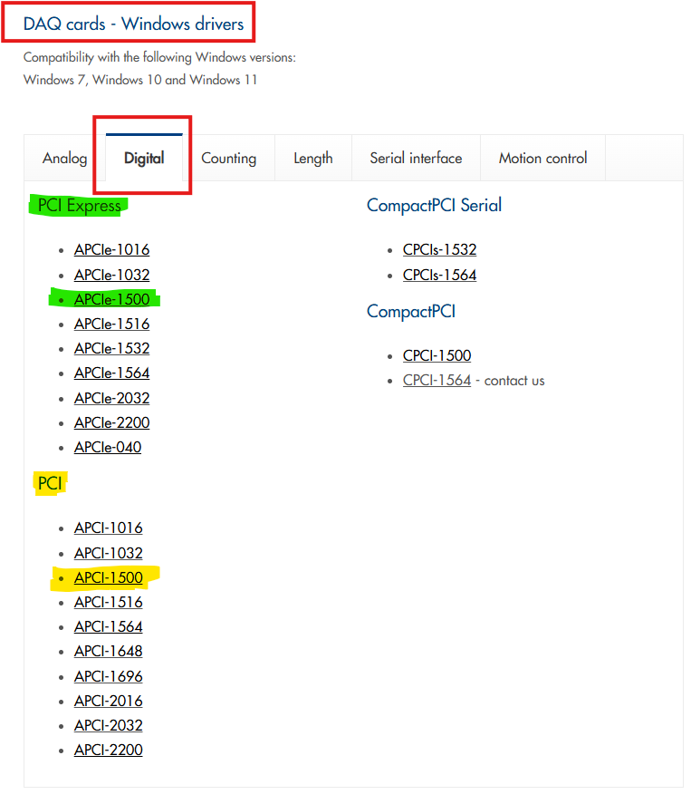

# APCI-1500

# APCI1500 Python Wrapper

This repository provides a Python wrapper for interacting with the PCI1500 digital IO board using the provided DLL.

## Contents

- [Overview](#overview)
- [Installation](#installation)
- [Usage](#usage)
  - [Initialize and Open Board](#initialize-and-open-board)
  - [Read Digital Inputs](#read-digital-inputs)
  - [Get Digital Outputs](#get-digital-ouputs)
  - [Control Digital Outputs](#control-digital-outputs)
  - [Set Digital Output Memory](#set-digital-output-memory)
  - [Close Board](#close-board)
- [Troubleshooting](#troubleshooting)
- [Contributing](#contributing)
- [License](#license)

## Overview

This library simplifies interaction with the PCI1500 board by wrapping its C-based DLL functions into Python methods. The library supports:

- Read digital input channels.
- Get digital input channels.
- Control 16 digital output channels.
- management digital output memory state.
- Function has been optimized, simple on IO_COM folder: [IO_COM](IO_COM/).

## Installation
0. Install driver for window OS(indows 7, Windows 10 and Windows 11):
  Folow this document: [Instructions install driver](Documentation/Installation_Instructions.pdf)

1. Clone the repository:
   ```bash
   git clone https://github.com/tuyenubuntu/apci-1500.git
   ```
2. Navigate to the library folder:
   ```bash
   cd lib
   ```
3. Ensure the `PCI1500.dll` file is in the `lib/pci1500` folder.

## Usage

### Initialize and Open Board

```python
from apci1500 import PCI1500

# Initialize the library
pci = PCI1500()

# Open the board
board_handle = pci.open_board()
if board_handle is None:
    print("Failed to open the board.")
    exit()
```

### Read Digital Inputs

#### Read 16 Digital Inputs
```python
# Read the 16 digital inputs
inputs = pci.read_16_inputs_status(board_handle)
print(f"Digital Inputs: {inputs}")
```

#### Read 1 Digital Inputs
```python
# Read the 16 digital inputs
in_channel = 1
in_channel_val = pci.read_1_input_status(board_handle, in_channel)
print(f"Status input channel {in_channel}: {in_channel_val}")

# Or use this function
# in_channel = 1
# in_channel_val = pci.read_inputs_status(board_handle, in_channel)
# print(f"Status input channel {in_channel}: {in_channel_val}")
```

### Get Digital Ouputs
#### Get 1 Digital Outputs
```python
out_channel = 2
out_channel_val = get_output_channel_status(board_handle, out_channel)
print(f"Status output channel {out_channel}: {out_channel_val}")
```
#### Get 16 Digital Outputs
```python
# get the 16 digital outputs
outputs = pci.get_16_outputs_status(board_handle)
print(f"Digital Outputs: {outputs}")
```

### Control Digital Outputs

#### Turn On/Off Specific Channels

```python
# Turn on channel 0
pci.set_output_on(board_handle, 0)

# Turn off channel 0
pci.set_output_off(board_handle, 0)
```

#### Turn On/Off All Channels

```python
# Turn on all outputs
pci.set_all_outputs_on(board_handle)

# Turn off all outputs
pci.set_all_outputs_off(board_handle)
```

### Set Digital Output Memory

```python
# Enable digital output memory
pci.set_digital_output_memory(board_handle, enable=True)

# Disable digital output memory
pci.set_digital_output_memory(board_handle, enable=False)
```

### Close Board

```python
# Close the board
pci.close_board(board_handle)
```

## Troubleshooting

- Ensure the `PCI1500.dll` file is located in the correct path as specified during initialization.
- Verify the board index if you have multiple boards connected.
- If functions return errors, refer to the PCI1500 documentation for error codes.
- If the `PCI1500.dll` file is missing or the system lacks drivers for the IO PCI-1500 card, visit the manufacturer's website to download the correct driver (ensure the driver matches your operating system version and PCI slot type on your motherboard): [ADDI-DATA Drivers](https://www.addi-data.com/drivers).



## Contributing

Feel free to open issues or submit pull requests to improve this library. Contributions are welcome!

## License

This library provides a Python wrapper for the PCI1500 DLL, which is part of the software suite provided by ADDI-DATA. The original DLL and associated tools can be obtained from ADDI-DATA's official website: [https://www.addi-data.com/drivers](https://www.addi-data.com/drivers).

The wrapper code in this repository is distributed under the MIT License. See the `LICENSE` file for details.


